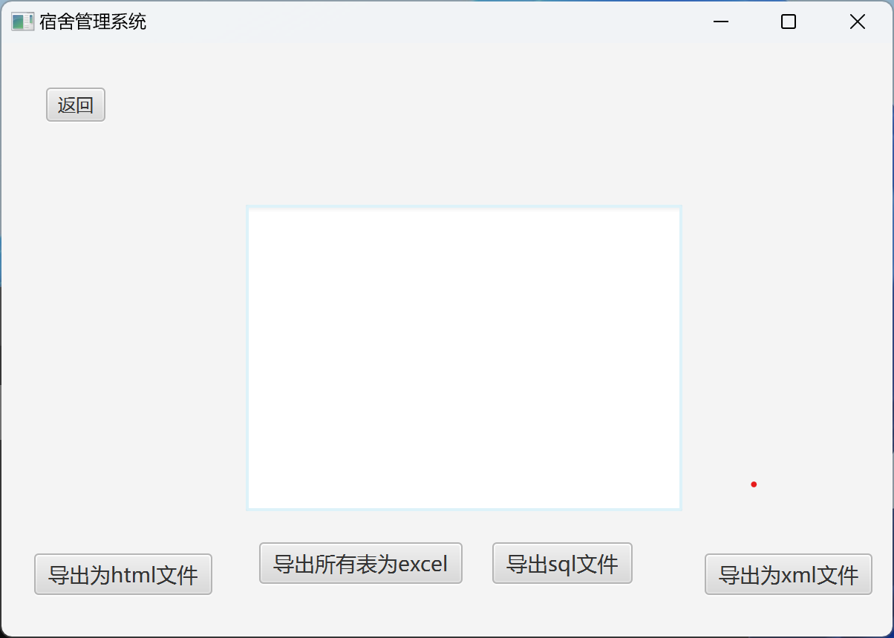
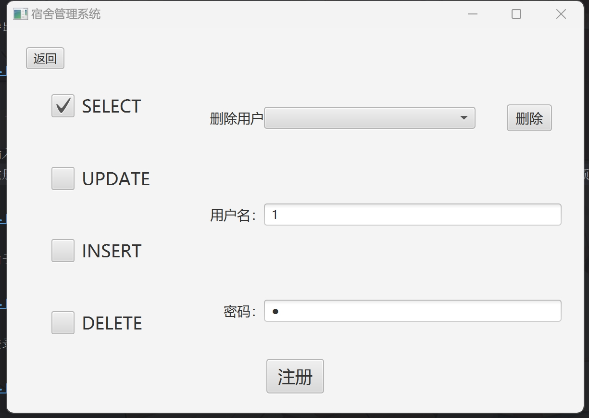
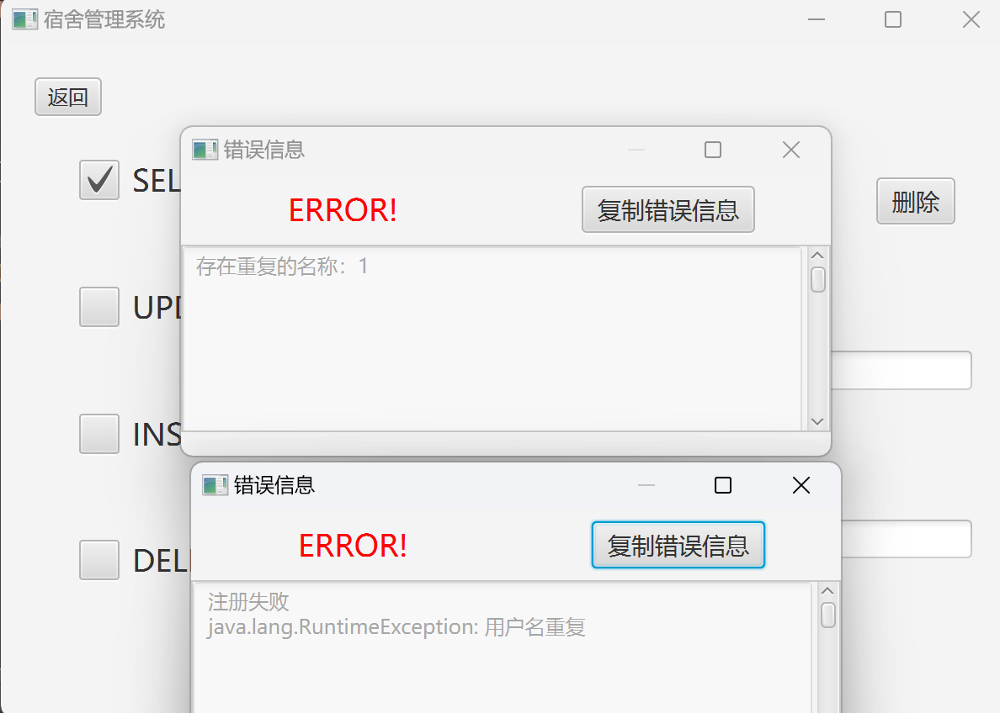
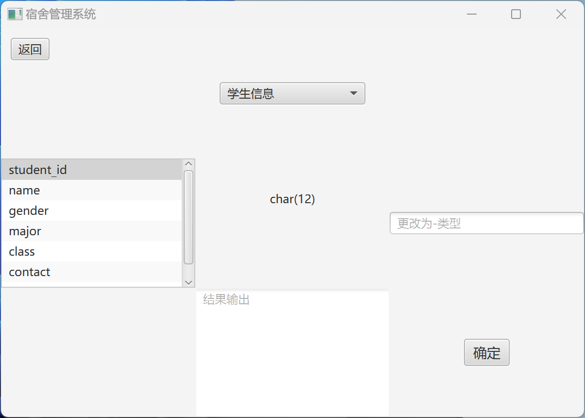

# MySQL JDBC 宿舍管理系统

## 项目描述
本项目为大数据课程作业，旨在通过 Java 与 MySQL 数据库交互实现宿舍管理功能。

## 运行环境要求
- Java Runtime Environment (JRE) 已内置在项目文件中，无需额外安装。

## 如何运行程序
1. 解压下载的压缩文件。
2. 确保 `jre` 文件夹与 `.exe` 可执行文件位于同一目录下，避免移动或分离这些文件。
3. 建议将整个解压后的文件夹放置于桌面，因为程序生成的文件默认保存位置为桌面。

## 注意事项
- 请勿将 `jre` 文件夹与 `.exe` 文件分开存放，否则可能导致程序无法正常启动。
- 程序生成的所有文件将保存在桌面上，请确保桌面有足够的权限进行读写操作。

## 程序运行截图
### 开始使用：
- 设置MySQL连接信息:（首次使用需要设置）

- 选择界面：可以选择不登录直接查询

### 查询界面：
- 可输入查询条件查询或直接展示整个表的信息：

- 同时可以导出为excel文件或直接为sql文件：  ——运用apache poi提供excel支持

- 导出的文件会放在桌面的一个叫宿舍管理系统的文件夹内，因此建议直接将解压后的文件夹放在桌面。

### 登录界面：
- 输入用户名和密码即可登录，同时放上注册按钮（懒得加用户个数限制了）：
-- 这里懒得再写一个页面了，直接用了error页面，注意区分

- 由于文件读取的原因，不能设置相同的名字！

- 登录成功后，可以进行增删改查操作：

### 增加记录：
- 增加记录时，需要输入所有标记为【NOT NULL】的信息
--输入错误信息会弹出错误提示框，并提示错误信息

### 修改记录值：
- 修改记录调用了查找记录的方法，因此可以先查找记录，选中条目直接点击修改即可

### 修改列属性：
- 修改列属性需要输入MySQL对应的列属性

### 删除记录：
- 删除记录也调用了查找记录的方法，因此可以先查找记录再删除

### 查找记录：
- 与前面的一样，不再写出。

## 文件说明：
 程序运行时会产生以下几种文件（均在桌面的宿舍管理系统目录里）：
- path：保存了加密后的数据库地址，用户名，密码
- dormitory.sql：你选择导出的sql文件
- （导出的）数据库原始文件.xlsx：你选择导出的excel文件
- user.txt：保存了此程序注册的用户名以及密码（加密后）